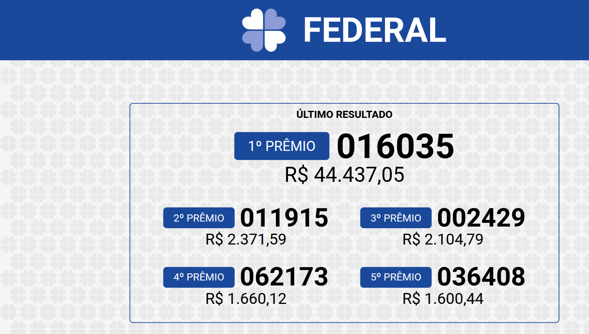
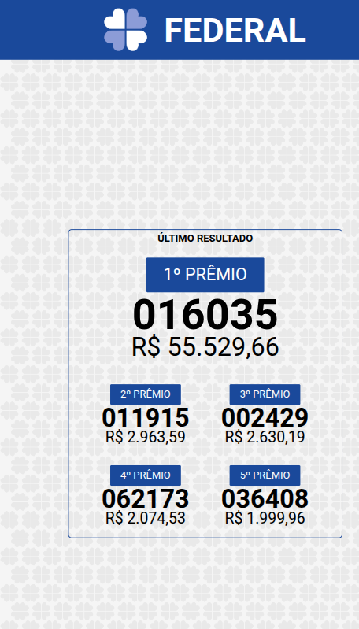
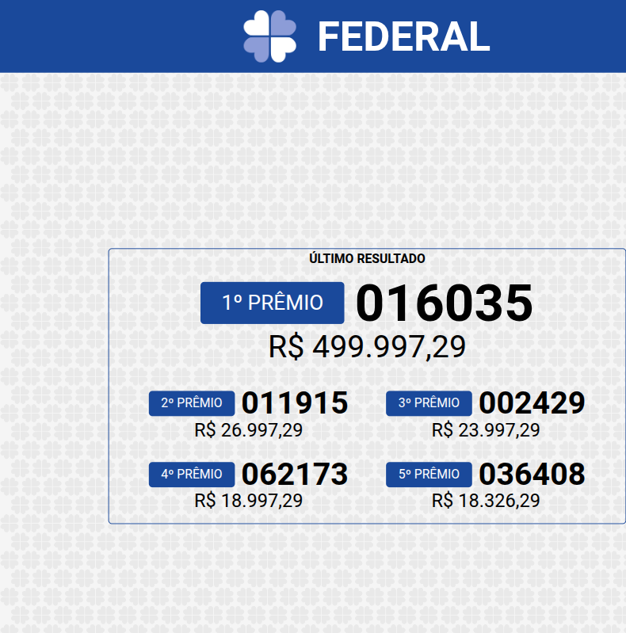

# DSPLAY - Loterias Caixa Template

A [React](https://reactjs.org/) [HTML-based template](https://developers.dsplay.tv/docs/html-templates) for the [DSPLAY - Digital Signage](https://dsplay.tv/) platform — displays the latest results and next estimated prize for Brazil's federal lottery games (Caixa Econômica Federal): Mega-Sena, Dupla-Sena, Quina, Lotofácil, Lotomania, Timemania, Dia de Sorte, and Federal.

> Built with [Vite](https://vitejs.dev/), requires Node.js 22.22.2+, 24.15.0+, or 26+ (see `.nvmrc`).

## Supported screen formats

| Landscape | Portrait | Square |
|-----------|----------|--------|
|  |  |  |

| Vertical banner |
|-------------------|
|  |

## Features

Cycles through whichever of the 8 supported games have result data present in the media (`media.iteration` picks which one shows), each with its own layout for landscape/portrait/square/horizontal-banner/vertical-banner screen formats.

All on-screen text is in Brazilian Portuguese by design — this template's entire purpose is displaying official Brazilian federal lottery results to a Brazilian audience, so the game names and labels are not translated to other languages.

## Template variables

This template has no `dsplay_template` variables — everything shown comes from `media.result.data`, a JSON-service payload keyed by game (`federal`, `megasena`, `duplasena`, `quina`, `lotofacil`, `lotomania`, `timemania`, `diadesorte`). See `public/dsplay-data.js` for a full example payload and `src/components/app/index.jsx` for how a game is picked.

## Local development

```sh
npm install
npm start
```

`public/dsplay-data.js` defines `dsplay_config`/`dsplay_media`/`dsplay_template` mock globals used only when the template isn't running inside the actual DSPLAY app. Edit `dsplay_media.result.data` to try out different results. The DSPLAY Player App replaces it with real content at runtime.

## Packing (release build)

```sh
npm run zip
```

This builds the template with Vite, which also generates `template-variables.json` + `template-example-data.json` (via [@dsplay/template-manifest](https://www.npmjs.com/package/@dsplay/template-manifest)'s Vite plugin) — the DSPLAY CMS reads these two files to auto-detect this template's variables and seed default preview values (an empty list here, since there are none). It then generates `template.zip`, ready to be deployed to the [DSPLAY Web Manager](https://manager.dsplay.tv/template/create).

## Maintaining dependencies

Regular npm dependencies, not vendored files:

```sh
npm outdated
npm update
```

For a version outside the declared range (typically a major bump), apply it deliberately and verify `npm start`, `npm run build`, and `npm test` still work before committing.

### Commit conventions

See [AGENTS.md](AGENTS.md).

## More

To see more about DSPLAY HTML Templates, visit: https://developers.dsplay.tv/docs/html-templates
